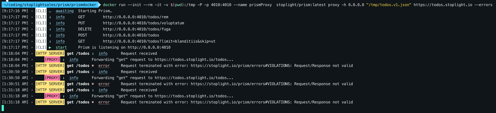

# Demo Environment

Some of the most challenging conversations with Stoplight customers require familiarity with the platform's open source products: [Prism](https://meta.stoplight.io/docs/prism/README.md) and [Spectral](https://meta.stoplight.io/docs/spectral/README.md).

This project is designed to provide you with the necessary resources to learn enough about these products at a high level, such that you can demonstrate their use.

To get started go to the section that corresponds to product that interests you:

## Spectral Guide

## Prism Guide

